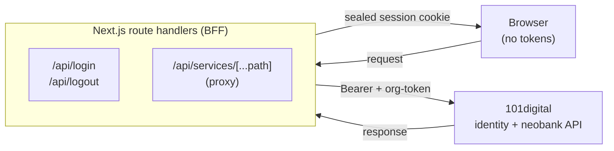

# Simple Invoice

A Next.js 16 invoicing app built as a 101digital assessment. It authenticates against
the 101digital identity server and lists and creates invoices through the 101digital
neobank API - using a **backend-for-frontend (BFF)** design in which OAuth credentials
and access tokens never reach the browser.

## Features

- **Secure OAuth2 login** against the 101digital identity server - credentials and tokens
  are handled entirely server-side.
- **Sealed-session auth with silent refresh** - one encrypted cookie, transparently
  refreshed so sessions outlive the 1-hour access token.
- **Invoice list** with filtering.
- **Create-invoice** flow with client-side validation (Zod) of every field before submit.
- **Tested** end to end - unit tests (Vitest + Testing Library) and browser e2e
  (Playwright).

## Tech stack

| Area      | Choice                                              |
| --------- | --------------------------------------------------- |
| Framework | Next.js 16 (App Router), React 19, TypeScript       |
| Styling   | Tailwind CSS v4, shadcn/ui (Radix UI), lucide-react |
| Data      | TanStack Query, Axios, Zod                          |
| Auth      | iron-session (AES-sealed cookie)                    |
| Testing   | Vitest, Testing Library, Playwright                 |
| Tooling   | pnpm, ESLint, Prettier, Husky + lint-staged         |

## Architecture

The browser never talks to the 101digital upstream directly. Every upstream call goes
through this app's own Next.js route handlers (the BFF), which hold the OAuth client
secret server-side, attach the `Bearer` and `org-token` headers, and return minimal
bodies. Tokens live only inside an encrypted cookie that the browser cannot read.



Three decisions worth calling out:

- **BFF pattern.** `CLIENT_ID` / `CLIENT_SECRET` and all tokens stay on the server. The
  client calls our own routes (e.g. `POST /api/login`); the upstream OAuth password grant
  and every authenticated API call happen server-side.
- **One sealed `session` cookie.** A single httpOnly cookie named `session` holds an
  iron-session AES-sealed payload `{ accessToken, refreshToken, orgToken, accessExpiresAt }`.
  Its contents are opaque to the browser - no token is ever client-readable. All session
  logic lives in `lib/auth/session.ts`.
- **Silent refresh, recover-vs-destroy.** The BFF refreshes the access token proactively
  (before expiry) and reactively (on an upstream 401), retrying transparently. Only a
  genuinely dead session clears the cookie and signals the client - via an
  `x-session-expired` response header - to redirect to `/login`. A plain 401 does not log
  the user out.

`proxy.ts` gates routes by cookie presence (redirecting `/login` <-> `/`); true session
validity is always enforced by the BFF, never the client.

### Project structure

```
app/
  (authenticated)/        # protected pages: invoice list (/) and create (/create)
  login/                  # login page
  api/
    login/  logout/       # auth route handlers
    services/[...path]/   # BFF proxy to the 101digital API
lib/
  auth/                   # session sealing, refresh, identity, schemas
  api/                    # upstream client, endpoints, invoice + org-token calls
  invoices/               # invoice domain logic (totals, schema, countries)
components/               # app-shell, forms, invoices, login, ui (shadcn)
hooks/                    # data hooks: invoices + create (TanStack Query), URL filters
proxy.ts                  # route protection (cookie-presence gating)
```

## Getting started

### Prerequisites

- **Node.js 20.9+** (developed on Node 24)
- **pnpm** (`npm install -g pnpm`)

### Install

```bash
git clone git@github.com:son-nguyen-301/SimpleInvoice.git
cd SimpleInvoice
pnpm install
```

### Configure environment

Copy the example file and fill in the values:

```bash
cp .env.example .env.local
```

| Variable         | Description                                                 |
| ---------------- | ----------------------------------------------------------- |
| `CLIENT_ID`      | OAuth client ID for the 101digital identity server          |
| `CLIENT_SECRET`  | OAuth client secret                                         |
| `AUTH_BASE_URL`  | Identity server base URL (no trailing slash)                |
| `API_BASE_URL`   | 101digital neobank API gateway base URL (no trailing slash) |
| `SESSION_SECRET` | Cookie encryption secret, **>= 32 chars**                   |

Generate a session secret with:

```bash
openssl rand -base64 32
```

> All variables are **server-only** - none use the `NEXT_PUBLIC_` prefix, so they are
> never bundled into client code. Never commit `.env.local`.

## Development

```bash
pnpm dev
```

Open [http://localhost:3000](http://localhost:3000). You'll be redirected to `/login`
until authenticated.

### Scripts

| Command             | Description                      |
| ------------------- | -------------------------------- |
| `pnpm dev`          | Start the dev server             |
| `pnpm build`        | Production build                 |
| `pnpm start`        | Run the production build         |
| `pnpm lint`         | ESLint                           |
| `pnpm format`       | Format with Prettier             |
| `pnpm format:check` | Check formatting without writing |
| `pnpm test`         | Run unit tests once (Vitest)     |
| `pnpm test:watch`   | Unit tests in watch mode         |
| `pnpm test:e2e`     | Run Playwright end-to-end tests  |

A Husky pre-commit hook runs `lint-staged` (ESLint + Prettier) on staged files.

## Testing

```bash
pnpm test       # unit + component tests (Vitest + Testing Library)
pnpm test:e2e   # browser end-to-end (Playwright)
```

The e2e suite seeds an authenticated session by sealing a real `session` cookie, so it
requires `SESSION_SECRET` to be set - Playwright loads your `.env*` files the same way
Next does (via `@next/env`), so the test runner's secret matches the dev server.

## Deploy (Vercel)

1. Push the repo to GitHub and import it into [Vercel](https://vercel.com/new) (Next.js is
   auto-detected; no extra config needed).
2. In **Project Settings -> Environment Variables**, add all five variables from
   [Configure environment](#configure-environment) (`CLIENT_ID`, `CLIENT_SECRET`,
   `AUTH_BASE_URL`, `API_BASE_URL`, `SESSION_SECRET`).
3. Deploy.

The session cookie is marked `Secure` in production, so it requires HTTPS - which Vercel
provides automatically.

## Notes for reviewers

The assessment uses **shared credentials**, and the 101digital WSO2 gateway honors only
the **most recently issued** access token per user. A second login - another browser tab,
another developer, or the login e2e test - server-side-revokes earlier tokens, even though
the older token has not yet expired. If a stale tab suddenly gets logged out, that is the
gateway's single-active-token policy, not a bug in this app; the BFF detects the relayed
401 and redirects to `/login` as designed.
